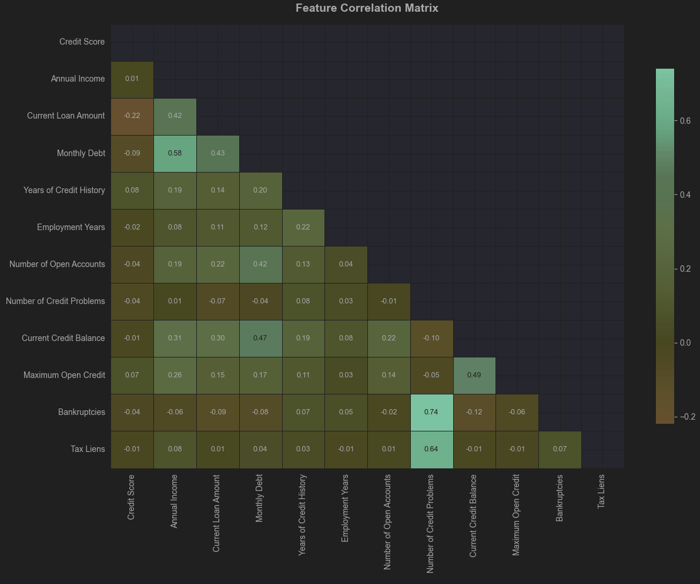
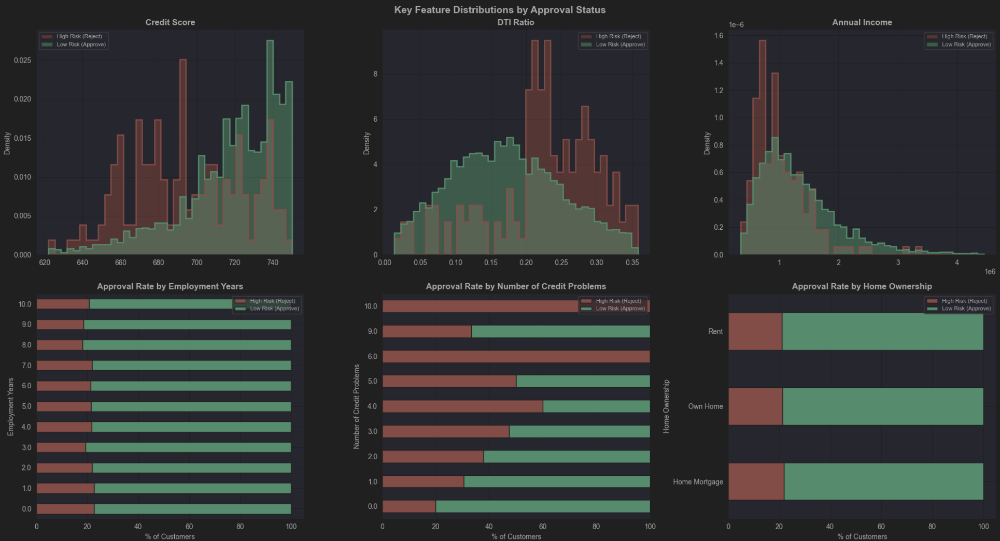
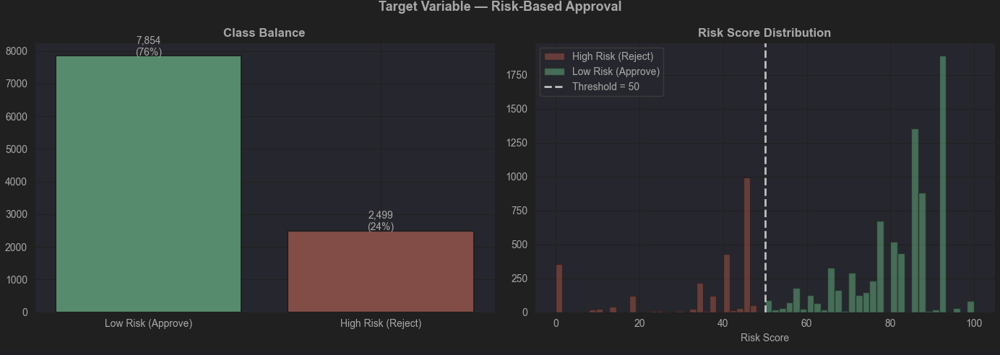
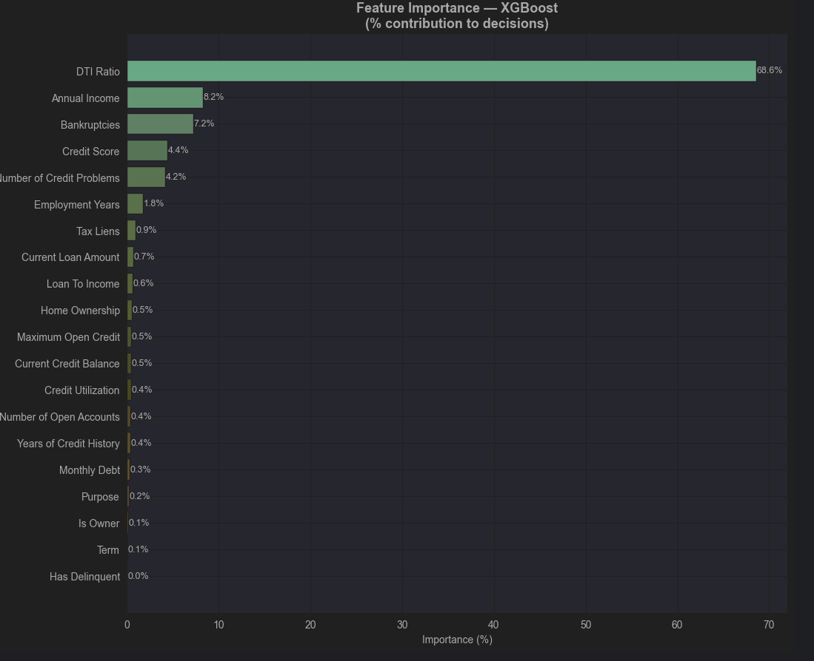
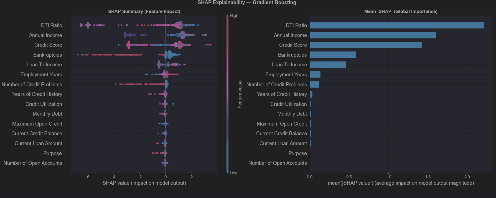
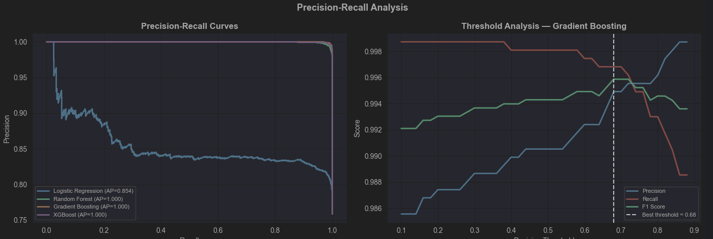
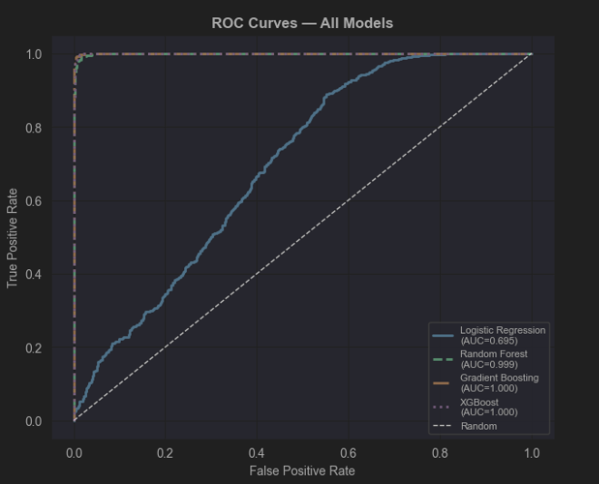

# Loan Approval Analysis

A full machine learning pipeline for credit risk scoring — from raw data to a deployable customer scoring function. The project is split into three notebooks that can be run sequentially.

---

## Project Structure

```
├── data/
│   ├── credit_test.csv          # Raw input data
│   ├── credit_cleaned.csv       # Output of notebook 1
│   └── credit_cleaned.parquet   # Output of notebook 1 (efficient format)
│
├── loan_data_cleaning.ipynb     # Notebook 1 — Data Cleaning
├── loan_eda.ipynb               # Notebook 2 — EDA & Feature Engineering
├── loan_ml.ipynb                # Notebook 3 — ML/DL Modeling
└── README.md
```

---

## Notebooks

### 1. `loan_data_cleaning.ipynb` — Data Loading & Cleaning

Loads the raw CSV, diagnoses quality issues, and produces a clean dataframe saved to disk.

| Step | Description |
|------|-------------|
| Data Loading | Read `credit_test.csv`, inspect shape, dtypes, and basic statistics |
| Missing Values | Visualize missing patterns via heatmap and bar chart |
| Anomaly Detection | Credit scores > 850 (e.g. 7510 → 751), loan amount placeholder `99,999,999`, inconsistent casing in `Purpose`, `HaveMortgage` in `Home Ownership` |
| Cleaning | Fix credit scores, null-out placeholder loan amounts, normalize categoricals, map `Years in current job` to numeric `Employment Years`, drop non-predictive ID columns |
| Save | Exports `credit_cleaned.csv` and `credit_cleaned.parquet` to `../data/` |

---

### 2. `loan_eda.ipynb` — Exploratory Data Analysis & Feature Engineering

Explores the cleaned data and constructs a risk-based binary target.

| Step | Description |
|------|-------------|
| Distributions | Histograms for Credit Score, Annual Income, Current Loan Amount, Monthly Debt, Years of Credit History |
| Categorical Features | Bar charts for Term, Home Ownership, Purpose |
| Correlation Heatmap | Pearson correlation across all numeric features |
| Outlier Analysis | Box plots for key financial features |
| Feature Engineering | Debt-to-Income Ratio (DTI), loan-to-income ratio, and other derived features |
| Target Construction | Risk-based binary label (Approve / Reject) engineered from scoring rules (see below) |
| EDA by Approval Status | Distributions split by approval outcome |






**Risk scoring rules used to construct the target:**

| Criterion | Threshold | Weight |
|-----------|-----------|--------|
| Credit Score | ≥ 680 | 30 pts |
| DTI Ratio | < 0.40 | 25 pts |
| No Credit Problems | = 0 | 20 pts |
| No Bankruptcies | = 0 | 15 pts |
| Employment stability | ≥ 2 years | 10 pts |

Customers scoring ≥ 50 are labelled **Low Risk (Approve = 1)**.



---

### 3. `loan_ml.ipynb` — Modeling, Evaluation & Scoring

Trains and compares four classifiers, explains predictions with SHAP, and provides a reusable scoring function.

| Step | Description |
|------|-------------|
| Preprocessing | Numeric imputation + scaling, categorical encoding via `ColumnTransformer` pipeline |
| Model Training | Logistic Regression, Random Forest, Gradient Boosting, XGBoost — all evaluated with stratified cross-validation |
| Evaluation | Classification report, ROC curves, AUC comparison, confusion matrix, precision-recall curve |
| Feature Importance | Tree-based feature importances (XGBoost / Random Forest) |
| SHAP Explainability | SHAP summary and waterfall plots for the best model |
| Customer Scoring | `score_customer()` function returns approval probability and risk band for any new customer |
| Batch Scoring | Score all customers in the dataset and export results |





**Models compared:**

| Model | Strengths |
|-------|-----------|
| Logistic Regression | Interpretable baseline, fast, regulatory-friendly |
| Random Forest | Handles non-linearity, robust to outliers |
| Gradient Boosting | Strong performance, good ensemble |
| XGBoost | Best overall — regularized boosting, state-of-the-art |

---

## Requirements

```bash
pip install numpy pandas matplotlib seaborn scikit-learn xgboost shap pyarrow
```

| Library | Purpose |
|---------|---------|
| `numpy`, `pandas` | Data manipulation |
| `matplotlib`, `seaborn` | Visualizations |
| `scikit-learn` | Preprocessing, models, evaluation |
| `xgboost` | Gradient boosted trees |
| `shap` | Model explainability |
| `pyarrow` | Parquet file support |




---

## Usage

Run the notebooks in order:

```bash
jupyter notebook loan_data_cleaning.ipynb
jupyter notebook loan_eda.ipynb
jupyter notebook loan_ml.ipynb
```

To score a new customer after running notebook 3:

```python
result = score_customer({
    "Credit Score": 720,
    "Annual Income": 75000,
    "Current Loan Amount": 20000,
    "Term": "Short Term",
    "Monthly Debt": 1500,
    "Years of Credit History": 12,
    "Years in current job": "5 years",
    "Home Ownership": "Home Mortgage",
    "Purpose": "Debt Consolidation",
    "Number of Credit Problems": 0,
    "Bankruptcies": 0.0,
    "Current Credit Balance": 12000,
    "Maximum Open Credit": 45000,
    "Number of Open Accounts": 5,
    "Tax Liens": 0.0,
    "Months since last delinquent": float("nan"),
})
print(result)
# → {"probability": 0.81, "risk_band": "Very Low Risk", "decision": "APPROVE"}
```

---

## Key Findings

| Insight | Detail |
|---------|--------|
| Top predictor | Credit Score — single strongest signal for approval |
| DTI Ratio | Customers with DTI > 0.40 are significantly more likely to be rejected |
| Credit Problems | Even 1 past credit problem drops approval odds dramatically |
| Bankruptcies | Near-zero tolerance in the scoring model |
| Employment stability | 5+ years in current job improves approval chances |
| Loan Purpose | Debt Consolidation is the dominant purpose (76% of applications) |

---

## Next Steps

1. **Get labelled data** — Replace the engineered target with real `Loan Status` outcomes
2. **Handle class imbalance** — Use SMOTE or `class_weight='balanced'` if approval rates are skewed
3. **Hyperparameter tuning** — Apply Optuna or `GridSearchCV` for XGBoost
4. **Monitoring** — Track model drift over time as customer profiles change
5. **Fairness audit** — Ensure the model does not discriminate on protected attributes
